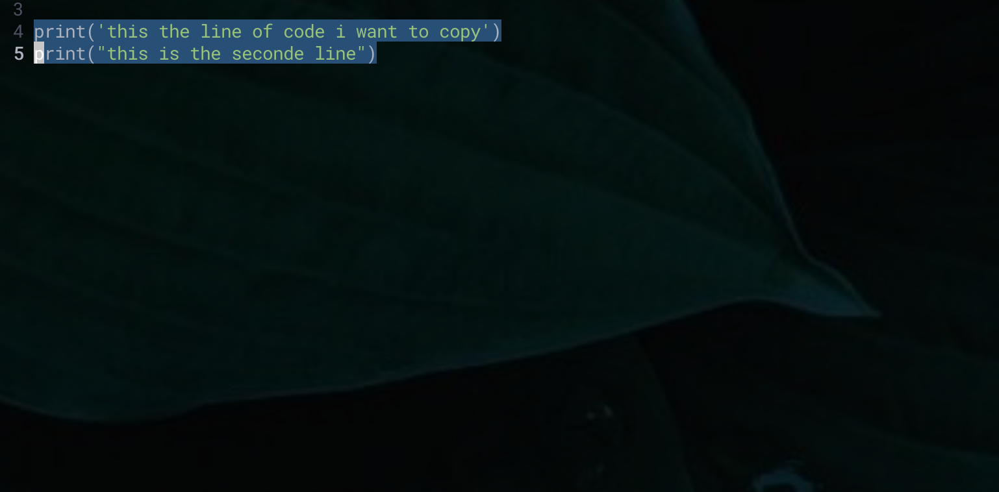
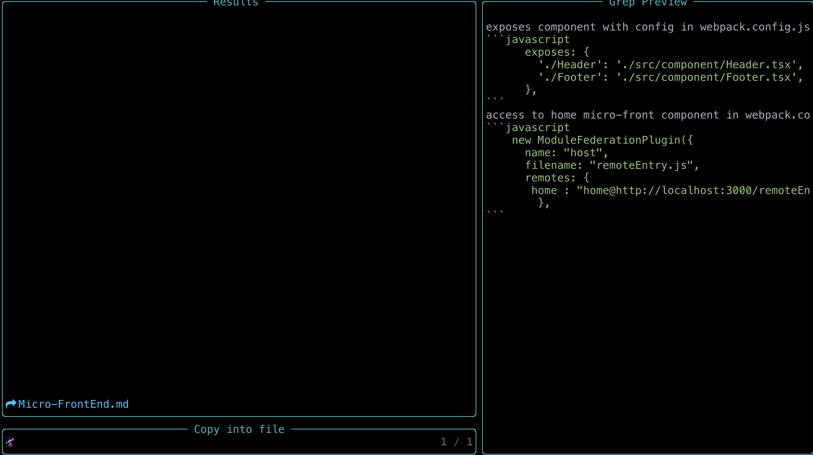
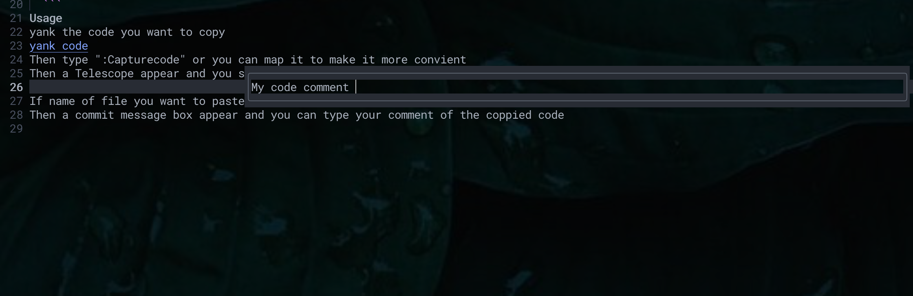

this is nvim plugin to copy your code and paste to markdown file.
I strongly suggest you to use this plugin with vimwiki as it will help you to take note of your code in you daily works easier   

**Requirement**
- nvim > 0.5 
- [Telescope](https://github.com/nvim-telescope/telescope.nvim)   

**Setup**   

Using [packer.nvim](https://github.com/wbthomason/packer.nvim)
  ```lua
  use {
    'lavixta/capturecodemd',
    requires = { {'nvim-telescope/telescope.nvim'} },
  }

  ```
  then you add your file path ( where you store all of your md files ):
  ```lua
   require("capturecodemd").setup({
   path ="your md path end with notes folder" --ex: /User/me/.config/mylibary/notes 
   })
  ```
**Usage**   

yank the code you want to copy 

Then type ":Capturecode" or you can map it to make it more convient 
Then a Telescope appear and you select the file you want to paste into in the Telescope picker



If name of file you want to paste into does not available you can just type it into the telescope picker and it will create a new one 

Then a commit message box appear and you can type your comment of the coppied code 

   

**TODO**
- implement the taking note with cmp. To make note as completed suggestion when write code 
- Combine it with Vimwiki 
- Create a blog website with show off the note you have taken 

